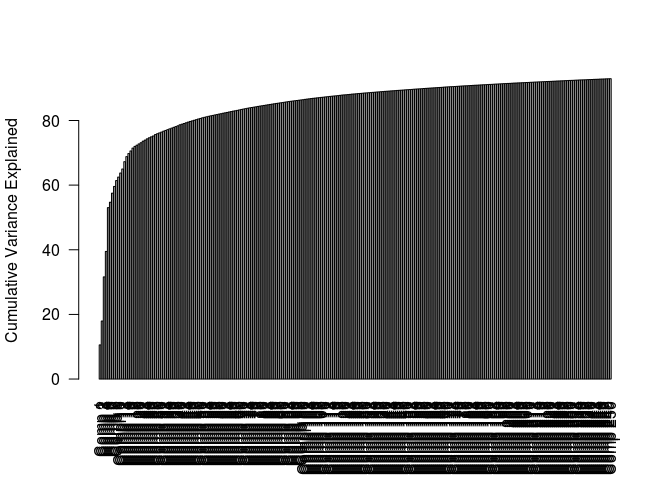
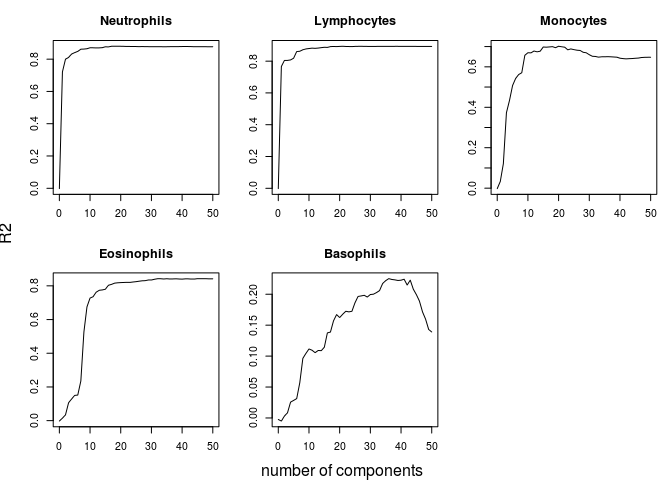
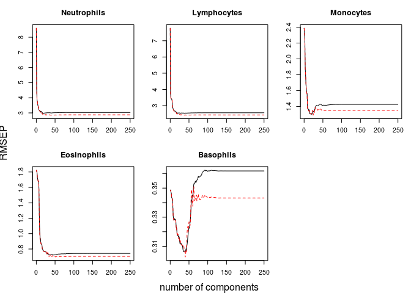
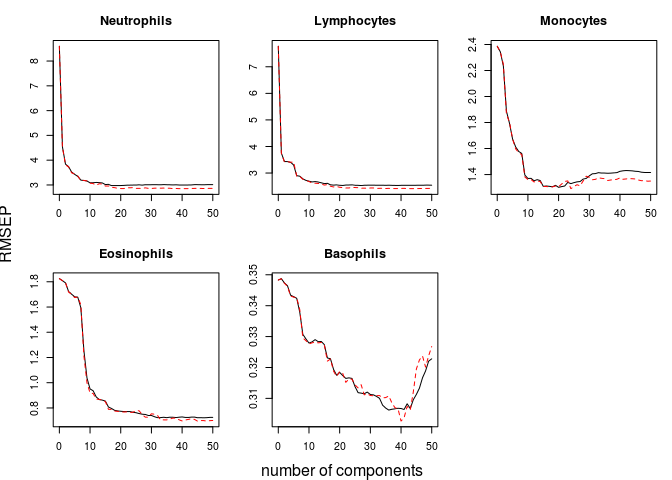
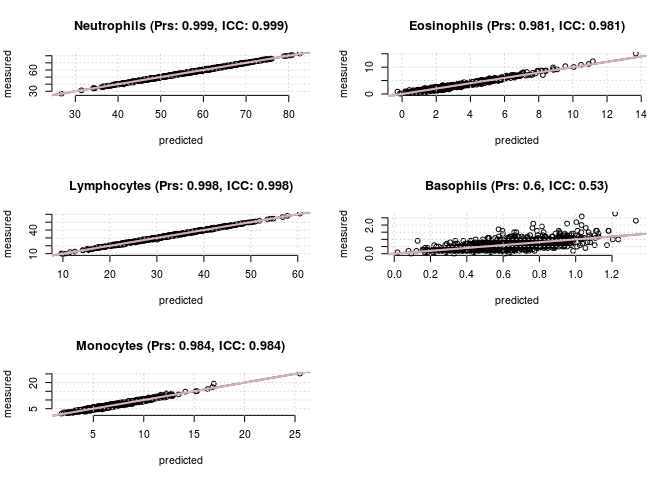
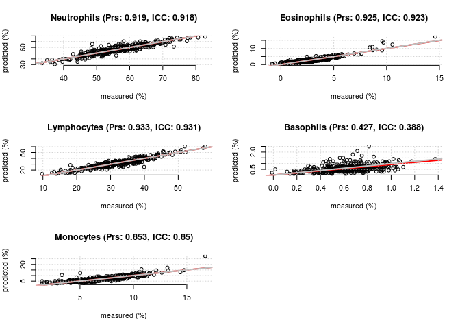
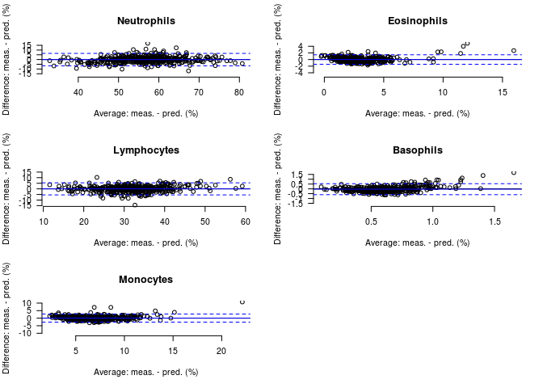

Predict wbcc using partial-least squares based on RNAseq or DNA methylation data
================
Maarten van Iterson, Department of Molecular Epidemiology, Leiden University Medical Center, Leiden, The Netherlands
24 February 2016

!!! This is a project in development !!!

wbccPredictor
=============

**wbccPredictor** can be used to build a predictor, using partial-least-squares, for WBCC based on gene expression or DNA methylation data. Or **wbccPredictor** can be used to predict WBCC using the build-in predictor for both gene expression and DNA methylation data.

Install
=======

Installation requires the package [devtools](https://github.com/hadley/devtools),

``` {.r}
library(devtools)
install_github("mvaniterson/wbccPredictor")
```

or using the `biocLite` function downloaded from [BioConductor](https://www.bioconductor.org/install/).

``` {.r}
source("http://bioconductor.org/biocLite.R")
biocLite("mvaniterson/wbccPredictor")
```

Using RNAseq data
=================

Building the predictor
======================

In this example BIOS RNAseq freeze1 data is used.

``` {.r}
library(BIOSRutils)
data(rnaSeqData_freeze1_06032015BIOS)
```

The RNAseq counts are normalized using *[edgeR](http://bioconductor.org/packages/release/bioc/html/edgeR.html)* TMM-function.

Some experimentation showed that strong filtering improves the performance of the predictor!

``` {.r}
library(edgeR)
library(GenomicFeatures)
d <- DGEList(counts = assays(rnaSeqData)$counts, remove.zeros = TRUE)
keep <- rowSums(d$counts > 100) > 0.99 * ncol(d)
d <- d[keep, ]
dim(d)  #[1] 13778  2116
```

    ## [1] 13778  2116

``` {.r}
library(genefilter)
sds <- rowSds(d$counts)
keep <- sds > quantile(sds, prob = 0.5)
sum(keep)
```

    ## [1] 6889

``` {.r}
d <- d[keep, ]
dim(d)  #[1] 6889 2116
```

    ## [1] 6889 2116

``` {.r}
d <- calcNormFactors(d)
data <- cpm(d, log = TRUE)  ##TMM CPM
data[1:5, 1:5]
```

    ##                 BD1NYRACXX-5-1 AD10W1ACXX-4-1 BD1NYRACXX-5-2
    ## ENSG00000000419       4.168507       4.339456       4.382197
    ## ENSG00000000938      10.069462      10.074595       9.959071
    ## ENSG00000001084       4.734471       4.288601       4.626306
    ## ENSG00000001461       5.629025       5.728971       5.536908
    ## ENSG00000001561       4.775422       3.304141       3.958505
    ##                 AD10W1ACXX-4-2 BD1NYRACXX-5-3
    ## ENSG00000000419       3.994125       4.134935
    ## ENSG00000000938      10.480343      10.460845
    ## ENSG00000001084       4.208172       4.204576
    ## ENSG00000001461       5.481339       5.190906
    ## ENSG00000001561       3.350550       3.214355

Next cell percentages and covariates need to be extracted.

``` {.r}
cellPercentages <- as.data.frame(colData(rnaSeqData)[, c("Neut_Perc", "Lymph_Perc", 
    "Mono_Perc", "Eos_Perc", "Baso_Perc")])
colnames(cellPercentages) <- c("Neutrophils", "Lymphocytes", "Monocytes", "Eosinophils", 
    "Basophils")
cellPercentages <- apply(cellPercentages, 2, as.numeric)
head(cellPercentages)
```

    ##      Neutrophils Lymphocytes Monocytes Eosinophils Basophils
    ## [1,]          NA          NA        NA          NA        NA
    ## [2,]          NA          NA        NA          NA        NA
    ## [3,]          NA          NA        NA          NA        NA
    ## [4,]          NA          NA        NA          NA        NA
    ## [5,]          NA          NA        NA          NA        NA
    ## [6,]          NA          NA        NA          NA        NA

``` {.r}
covariates <- as.data.frame(colData(rnaSeqData))
covariates <- covariates[, c("RNA_BloodSampling_Age", "Sex")]
colnames(covariates) <- c("Age", "Gender")
covariates <- apply(covariates, 2, as.numeric)
head(covariates)
```

    ##       Age Gender
    ## [1,] 77.9      0
    ## [2,] 70.5      1
    ## [3,] 66.3      0
    ## [4,] 76.5      0
    ## [5,] 71.9      0
    ## [6,] 68.6      1

Make sure all data object have the same id.

``` {.r}
rownames(covariates) <- rownames(cellPercentages) <- colnames(data) <- colData(rnaSeqData)$uuid
head(covariates)
```

    ##               Age Gender
    ## BIOS6DB3BAD1 77.9      0
    ## BIOSCFA14234 70.5      1
    ## BIOSCA449668 66.3      0
    ## BIOS415A8BFB 76.5      0
    ## BIOSD16ED999 71.9      0
    ## BIOSD2B838B2 68.6      1

``` {.r}
head(cellPercentages)
```

    ##              Neutrophils Lymphocytes Monocytes Eosinophils Basophils
    ## BIOS6DB3BAD1          NA          NA        NA          NA        NA
    ## BIOSCFA14234          NA          NA        NA          NA        NA
    ## BIOSCA449668          NA          NA        NA          NA        NA
    ## BIOS415A8BFB          NA          NA        NA          NA        NA
    ## BIOSD16ED999          NA          NA        NA          NA        NA
    ## BIOSD2B838B2          NA          NA        NA          NA        NA

``` {.r}
data[1:6, 1:6]
```

    ##                 BIOS6DB3BAD1 BIOSCFA14234 BIOSCA449668 BIOS415A8BFB
    ## ENSG00000000419     4.168507     4.339456     4.382197     3.994125
    ## ENSG00000000938    10.069462    10.074595     9.959071    10.480343
    ## ENSG00000001084     4.734471     4.288601     4.626306     4.208172
    ## ENSG00000001461     5.629025     5.728971     5.536908     5.481339
    ## ENSG00000001561     4.775422     3.304141     3.958505     3.350550
    ## ENSG00000001629     5.475888     4.807971     5.260365     4.826678
    ##                 BIOSD16ED999 BIOSD2B838B2
    ## ENSG00000000419     4.134935     3.954608
    ## ENSG00000000938    10.460845    10.450733
    ## ENSG00000001084     4.204576     4.223557
    ## ENSG00000001461     5.190906     5.125365
    ## ENSG00000001561     3.214355     2.613582
    ## ENSG00000001629     5.124162     4.607147

Find out which samples have complete cell percentages available.

``` {.r}
nas <- apply(cellPercentages, 1, function(x) any(is.na(x)))
table(nas)
```

    ## nas
    ## FALSE  TRUE 
    ##  1276   840

And which are incomplete

``` {.r}
complete <- which(!nas)
head(cellPercentages[complete, ])
```

    ##              Neutrophils Lymphocytes Monocytes Eosinophils Basophils
    ## BIOSDC47446B        46.3        41.1       9.6         2.4       0.6
    ## BIOSDC466DD5        47.2        41.5       8.7         1.9       0.7
    ## BIOS60E9E875        46.1        36.0      10.0         7.2       0.7
    ## BIOS0F99014C        59.7        27.5       7.4         5.1       0.3
    ## BIOSCA63D390        56.5        32.9       8.5         1.6       0.5
    ## BIOS519649FD        39.7        44.9      13.0         1.3       1.1

split complete in train (2/3) and test (1/3) **stratified splitting of the data might be better if sample size is small \< 500? for example using split.sample from caTools**

``` {.r}
trainId <- sample(complete, 2 * length(complete)/3)
testId <- complete[!(complete %in% trainId)]
```

``` {.r}
dataTrain <- data[, trainId]
covarTrain <- covariates[trainId, ]
cellPerTrain <- cellPercentages[trainId, ]
```

Now build the predictor!

``` {.r}
library(wbccPredictor)
pls.options(parallel = 8)  ##use 10 cores e.g. on the VM
predictor <- train(dataTrain, covarTrain, cellPerTrain, ncomp = 250, validation = "CV", 
    model = formula(cellPercentages ~ covariates + data), keep.model = TRUE)
```

The usual *[pls](http://cran.fhcrc.org/web/packages/pls/index.html)* functions can be used to inspect the predictor-object. For example,

``` {.r}
summary(predictor)
cumsum(explvar(predictor))
```

and,

``` {.r}
barplot(cumsum(explvar(predictor)), las = 2, ylab = "Cumulative Variance Explained")
```



``` {.r}
validationplot(predictor, val.type = "R2", ncomp = 1:50)  ##select optimal number of components
```


``` {.r}
validationplot(predictor, val.type = "RMSEP", ncomp = 1:250)  ##select optimal number of components
```



``` {.r}
validationplot(predictor, val.type = "RMSEP", ncomp = 1:50)  ##select optimal number of components
```



Determine optimal number of pls-components e.g. 40 and save the coefficients like this:

``` {.r}
RNAseqPredictor <- coef(predictor, ncomp = 40, intercept = TRUE)[, , 1]
```

It is interesting to known which covariates have the highest prediction value and store these as well.

``` {.r}
W <- predictor$loading.weights
ord <- order(abs(W[, 40]), decreasing = TRUE)
RNAseqTop <- gsub("data|covariates", "", rownames(W)[ord[1:1000]])
```

``` {.r}
save(RNAseqTop, file = "../data/RNAseqTop.RData")
save(RNAseqPredictor, file = "../data/RNAseqPredictor.RData")
```

Some validation using the Test-set
==================================

``` {.r}
corrplot <- function(measured, predicted, xlab = "predicted", ylab = "measured", 
    ...) {
    for (k in 1:ncol(measured)) {
        type <- colnames(measured)[k]
        pc <- signif(cor(predicted[, k], measured[, k]), 3)
        ic <- signif(icc(predicted[, k], measured[, k]), 3)
        plot(predicted[, k], measured[, k], main = paste(type, " (Prs: ", pc, 
            ", ICC: ", ic, ")", sep = ""), xlab = xlab, ylab = ylab, bty = "n", 
            pty = "s", ...)
        abline(lm(measured[, k] ~ 0 + predicted[, k]), col = 2, lty = 1, lwd = 2)
        abline(0, 1, col = "grey", lty = 1, lwd = 2)
        grid()
    }
}

baplot <- function(x, y, regline = FALSE, la = c("log", "lin", "both"), main = "", 
    xlab = "Average", ylab = "Difference") {
    la <- match.arg(la)
    for (k in 1:ncol(x)) wbccPredictor:::.baplot(x[, k], y[, k], regline = regline, 
        la = la, main = paste0(colnames(x)[k]), xlab = xlab, ylab = ylab)
    
}
```

This is no surprise!

``` {.r}
predictedRNATrain <- predictor$fitted.values[, , 40]
op <- par(mfcol = c(3, 2))
corrplot(cellPerTrain, predictedRNATrain, xlab = "predicted", ylab = "measured")
par(op)
```



Now let predict cell composition for the test data and plot.

``` {.r}
dataTest <- data[, testId]
covarTest <- covariates[testId, ]
cellPerTest <- cellPercentages[testId, ]
predictedRNATest <- prediction(predictor, dataTest, covarTest, ncomp = 40, transformation = function(x) x)
op <- par(mfcol = c(3, 2))
corrplot(cellPerTest, predictedRNATest, xlab = "measured (%)", ylab = "predicted (%)")
par(op)
```



``` {.r}
op <- par(mfcol = c(3, 2))
baplot(cellPerTest, predictedRNATest, la = "lin", xlab = "Average: meas. - pred. (%)", 
    ylab = "Difference: meas. - pred. (%)", regline = FALSE)
par(op)
```



Using DNA methylation data
==========================

see [example R script for 450K data](demo/example450k.R)

TODO
====

-   extend README
-   remove imputation of NA's this should be up to the user
